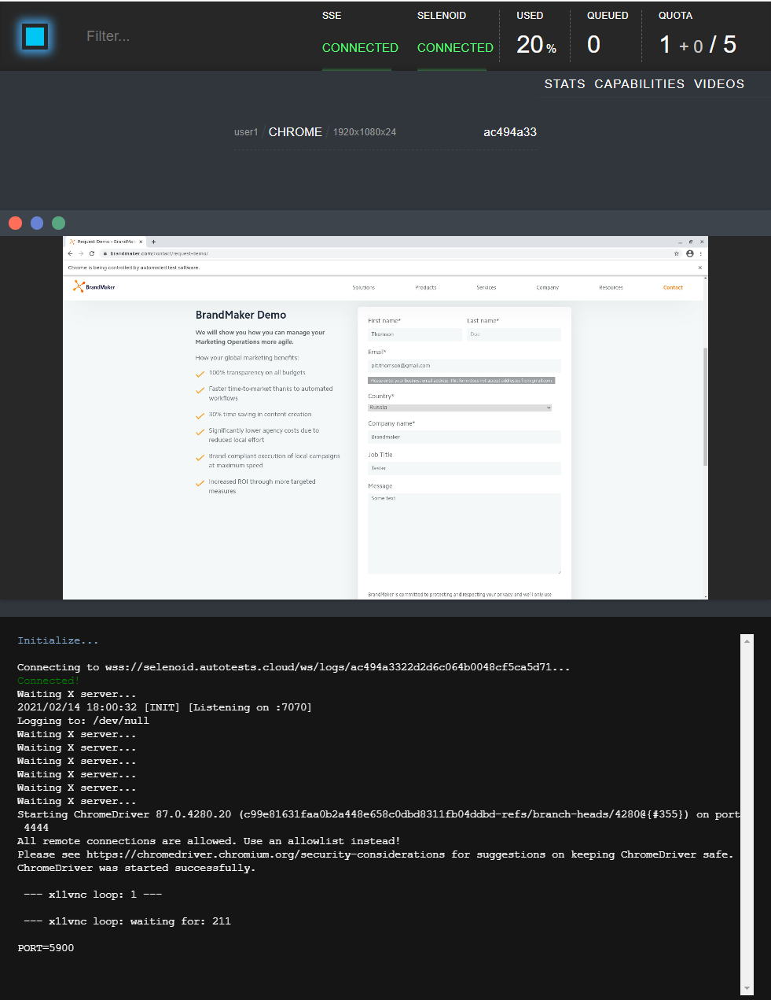
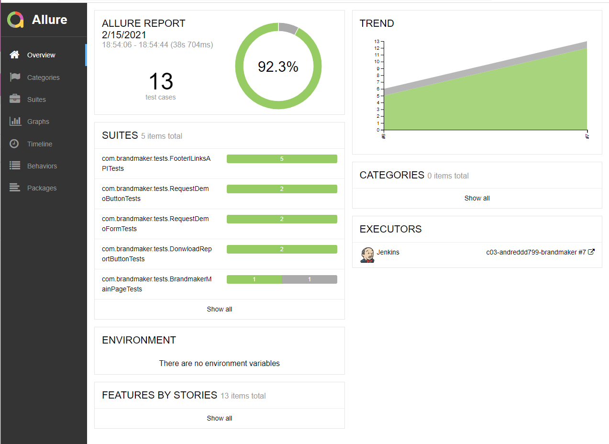
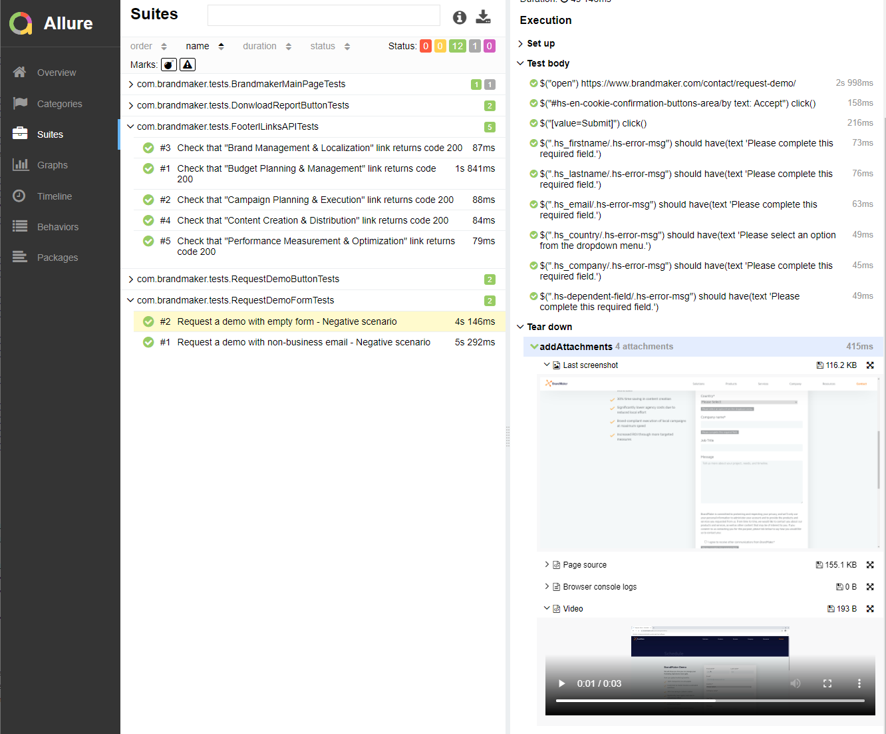
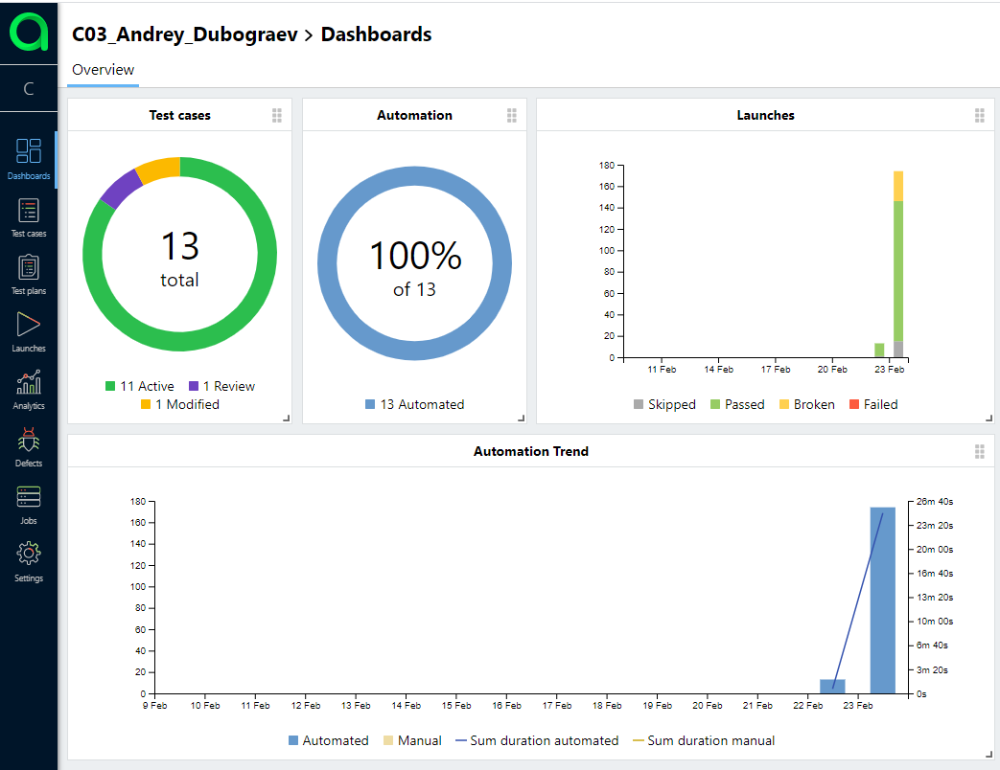
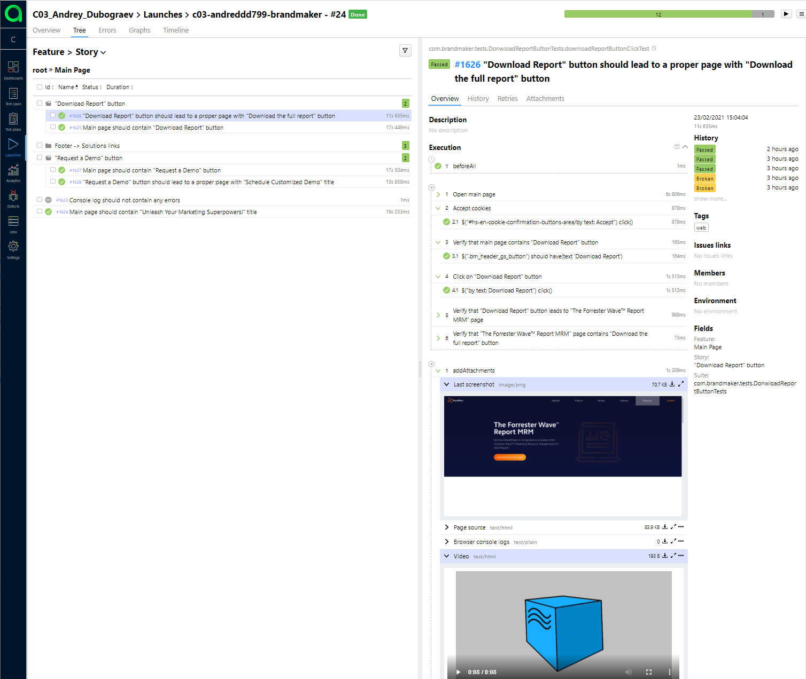
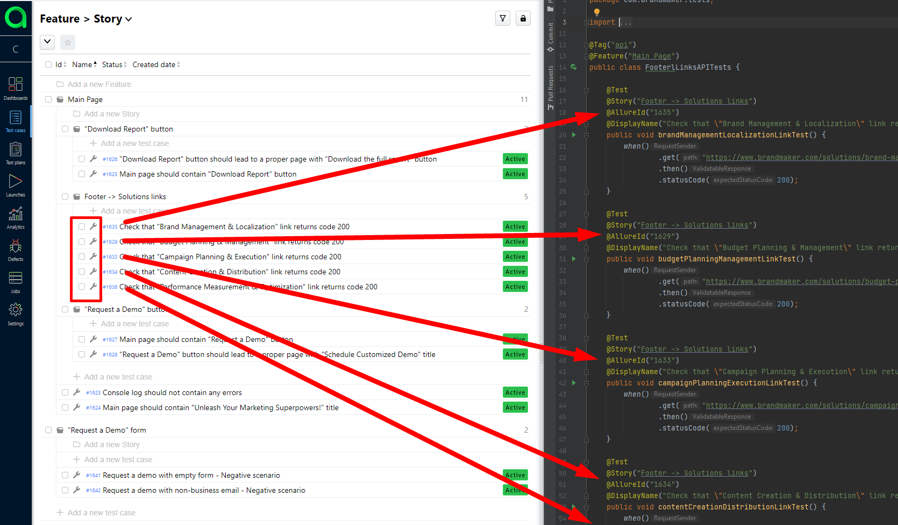
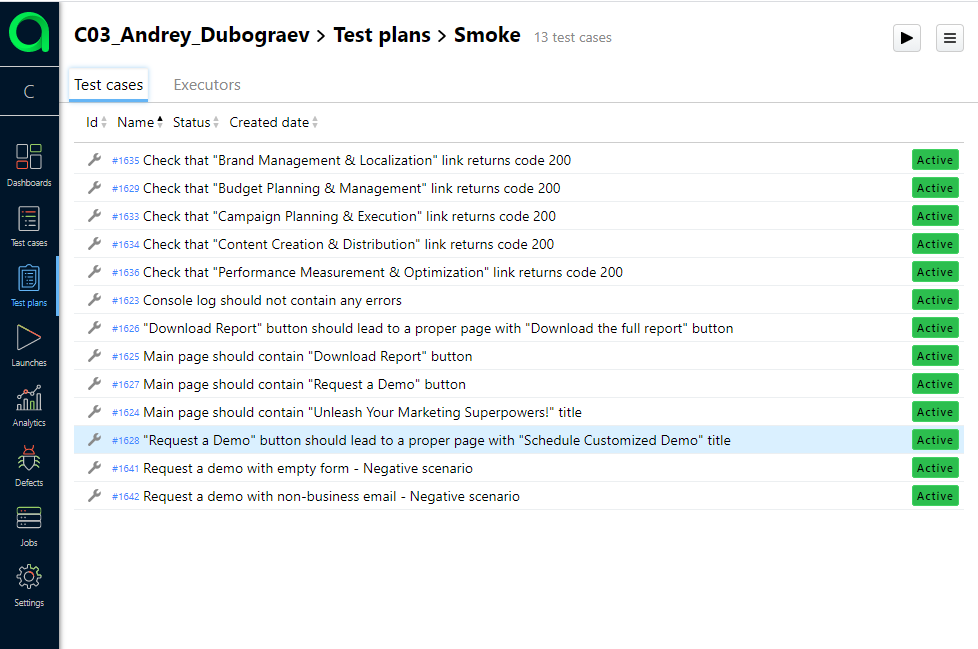
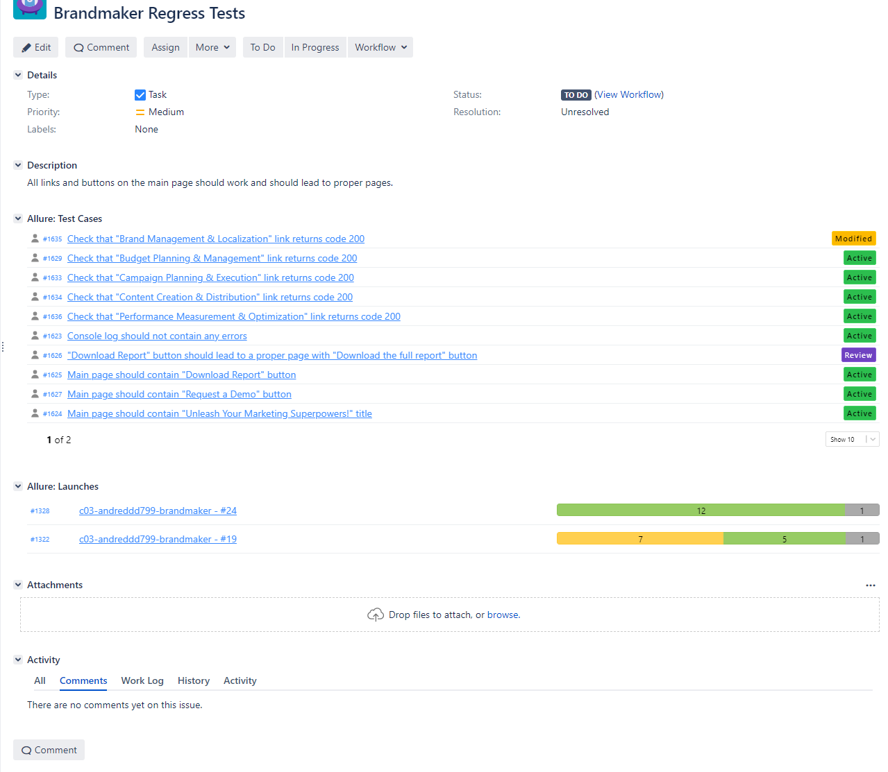
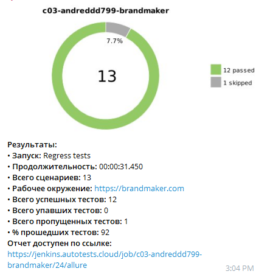

Github Repo:
https://github.com/dubograev/brandmaker_tests

Jenkins job:
https://jenkins.autotests.cloud/job/c03-andreddd799-brandmaker/
 
 

## **What additional tools do I use in my tests?**

## *Selenoid - a lightning fast Selenium protocol implementation running browsers in Docker containers:*

 
 
 

## *Allure Report - it is a flexible lightweight test report tool:*

 
 
 

## *Allure TestOps is a TMS that allows to manage all test related stuff in one place:*

 
 
 

## *Jira - it needs no introduction. Allure TestOps can be integrated with Jira:*

 
 
 

## *Telegram notifications:*

