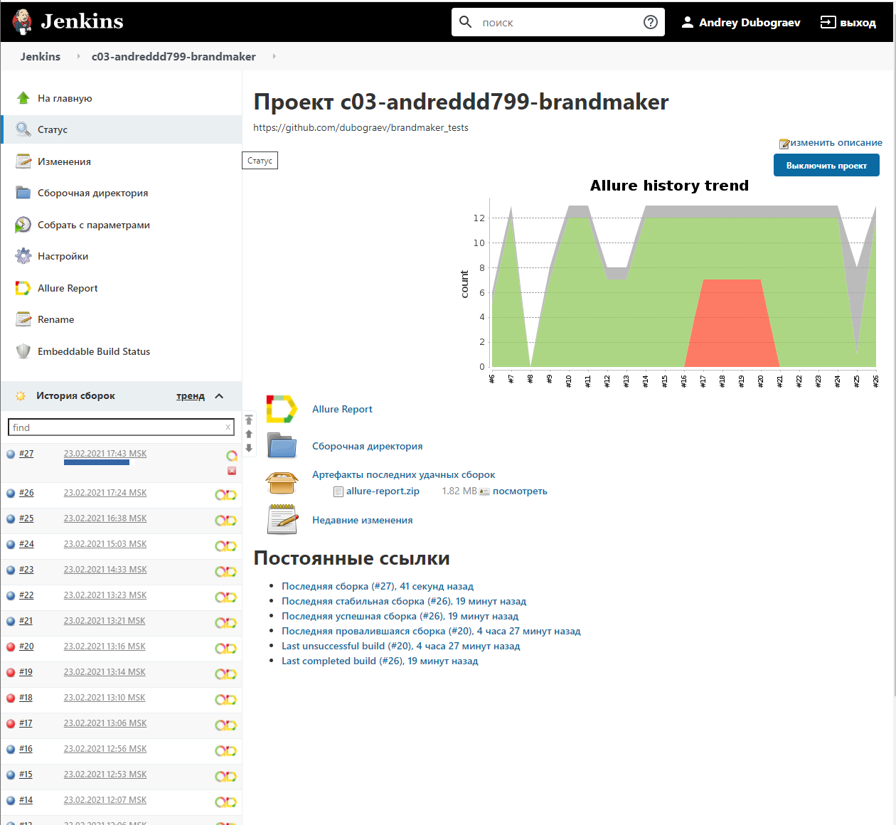
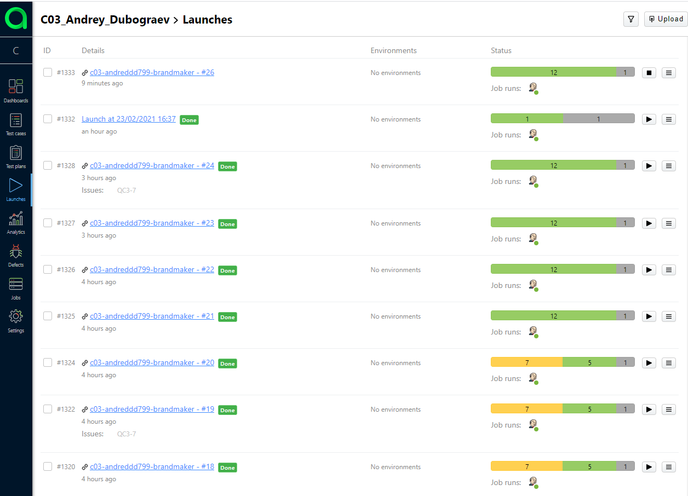

# Tests for Brandmaker.com website
### UI tests:
- Main page tests
- Tests for Download Report and Request a Demo buttons
- Tests for Request a Demo form

### API Tests:
- Footer links tests
  

## Technology Stack
**Java, Selenide, Rest-Assured, Junit5, Gradle, Allure Reports, Allure TestOps, Jenkins, Selenoid, Telegram Bot, Jira.**
  

## Screenshots
#### *Jenkins - it is an open source automation server:*

 
 
 

#### *Allure Report - it is a flexible lightweight test report tool:*

 
 
 

#### *Allure TestOps - it is a TMS that allows to manage all test related stuff in one place:*

 
 
 

#### *Telegram notifications:*

 
 
 

#### *Jira - it needs no introduction. Allure TestOps can be integrated with Jira:*

 
 
 

#### *Selenoid - a lightning fast Selenium protocol implementation running browsers in Docker containers:*

 
 
 

Github Repo:
https://github.com/dubograev/brandmaker_tests

Jenkins job:
https://jenkins.autotests.cloud/job/c03-andreddd799-brandmaker/  